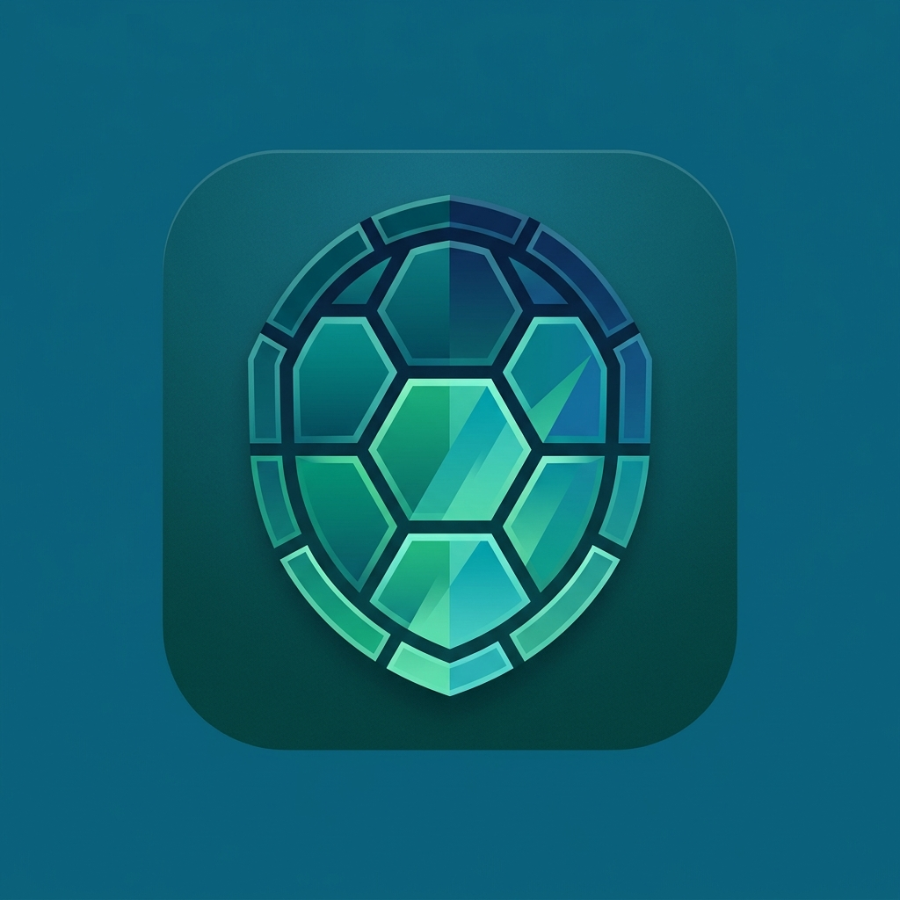

<div align="center">
  
  <h1>Chelona Vault 🐢</h1>
  <p><b>La tua roccaforte digitale. Sicura, Locale, Inviolabile.</b></p>
  
  [](https://reactjs.org/)
  [](https://capacitorjs.com/)
  [](https://tailwindcss.com/)
  [](https://opencv.org/)
</div>

<br>

Chelona è un ecosistema **Local-First** e **Zero-Knowledge** progettato per la gestione finanziaria e documentale personale. Non esistono server centrali, non esiste cloud non criptato. Tutti i tuoi dati vivono nel tuo dispositivo, protetti da una crittografia di livello bancario AES-GCM-256.

Il design di Chelona si basa sulla nuova estetica **"Oasis"**: calma, pulita e professionale.

---

## ✨ Funzionalità

### 🛡️ Sicurezza di Grado Militare (Zero Knowledge)
- **Crittografia Locale**: Ogni spesa, nota o PDF è crittografato *prima* di essere salvato sul dispositivo.
- **Biometria Integrata**: Sblocco rapido tramite impronta digitale o FaceID senza sacrificare la chiave AES Master.
- **Auto-Lock Intelligente**: Chiusura ermetica dell'app dopo inattività o alla chiusura.
- **Navigazione con Gesture**: Supporto completo alle gesture native di Android (indietro/avanti) integrate con lo storico dell'app.


### 💸 Gestione Spese Avanzata
- **Dashboard Analitica**: Grafici dell'andamento mensile e gestione dei budget.
- **Mini-Wallets Integrati**: Moduli specifici per auto, casa e portafogli.
- **Spese Condivise (Split)**: Modulo per tracciare rapidamente i "Chi deve a chi" tra amici e coinquilini.

### 📄 Scanner Intelligente (Stile Adobe Scan)
- **Auto-Capture & AI**: Non devi più premere il pulsante. Il modello OpenCV.js integrato rileva i bordi del foglio e, se stabili per 1.5s, acquisisce il documento in autonomia.
- **Whiteboard Effect**: Filtro locale avanzato che rimuove le imperfezioni, sbianca la carta e converte il testo in nero puro ad alto contrasto.
- **Pieno Controllo Offline**: Ritaglio manuale e rotazione disponibili senza mai inviare l'immagine a un server.

### 🛠️ Strumenti Offline
- **Utility PDF**: Unisci PDF, converti Immagini in Documenti e ruota le pagine localmente.
- **Generatore QR e Scanner Rapido**.

---

## 🚀 Installazione & Sviluppo

Chelona è sviluppata in **React + Vite** e compilata per Android tramite **Capacitor**.

### Prerequisiti
1. Node.js (v18+)
2. Android Studio (per la build generata)

### Avvio Locale (Web)
```bash
npm install
npm run dev
```

### Compilazione per Android
```bash
npm run build
npx cap sync android
npx cap open android
```
*(Oppure utilizza lo script automatizzato `publish.sh` incluso nel progetto).*

---

## 🔮 Roadmap Futura
- [ ] **Esportazione PDF/CSV** per reporting annuale delle spese.
- [ ] **Sincronizzazione P2P**: Sync tra dispositivi tramite WebRTC o un Relay cifrato completamente e2e.
- [ ] **Importazione da Estratto Conto**: Parsing intelligente dei PDF bancari per la catalogazione automatica delle spese offline.
- [ ] **Tema Esteso**: Modalità scura "Oceano" e widget Android/iOS nativi.

---

<p align="center">
  <i>Costruito con cura per garantire il diritto fondamentale alla privacy digitale.</i>
</p>
